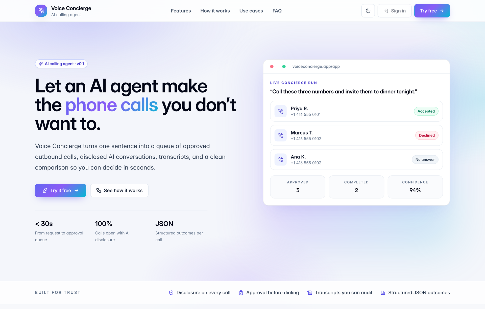
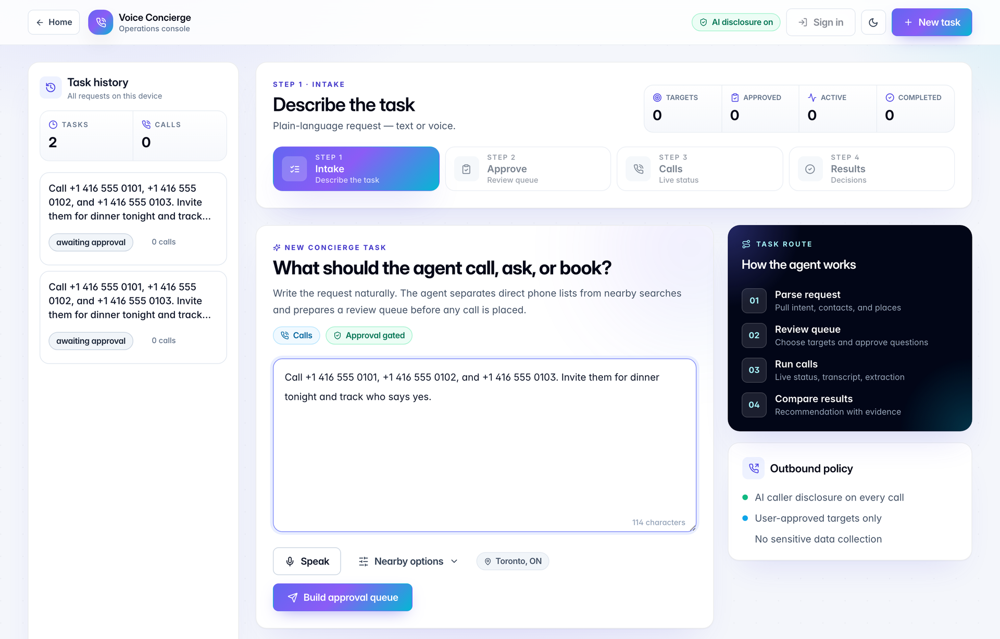
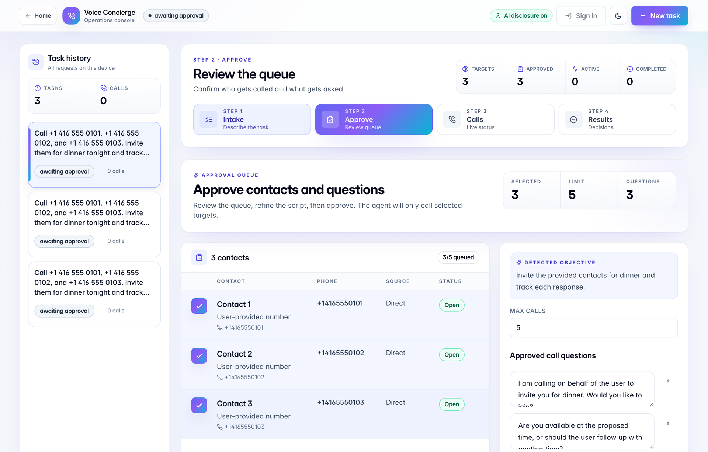
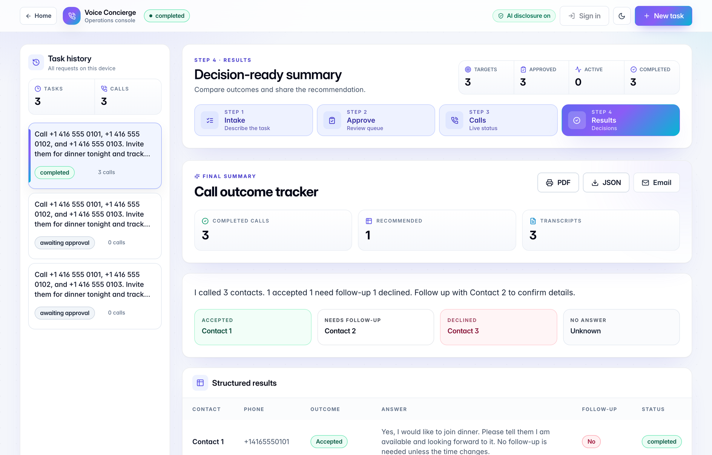
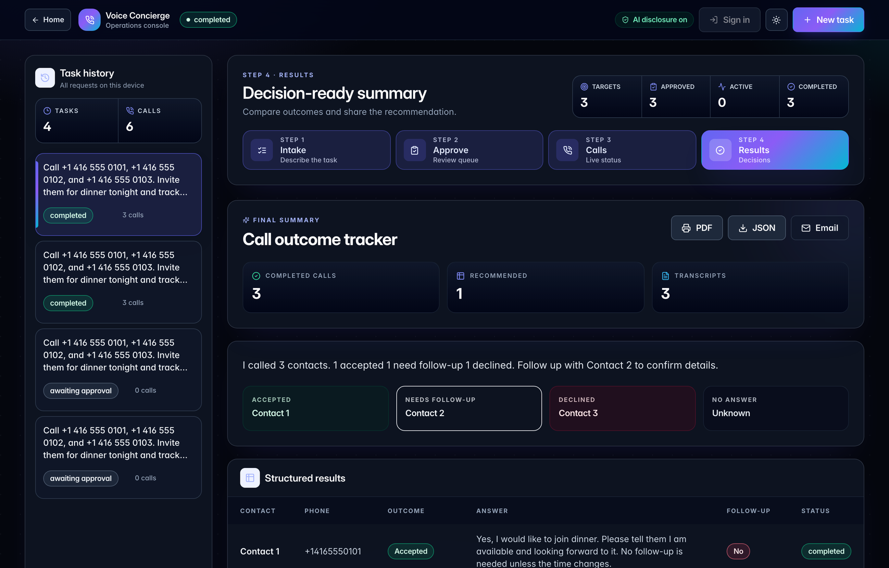
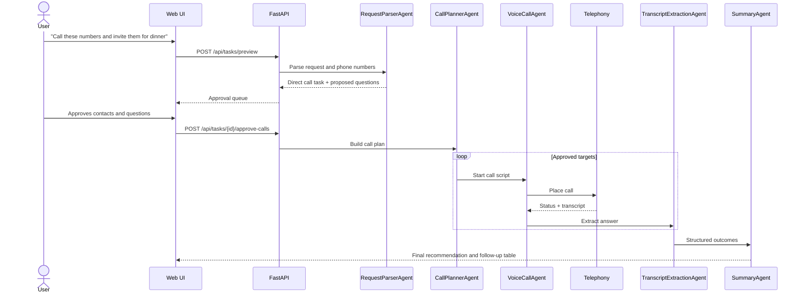

# Voice Concierge Agent

Voice Concierge Agent is a production-oriented MVP for turning natural-language requests into approved outbound calls, structured transcripts, and decision-ready summaries.

Example requests:

- "Call the below numbers and invite them for dinner. Keep track of who said yes."
- "Book an appointment with a doctor from Apple Tree at Harbour Street near me."
- "Find nearby restaurants with happy hours and ask whether they have vegan meal options."
- "Call salons near me and ask who has availability tomorrow afternoon."

The app is intentionally not limited to restaurant filters. Users can type or speak general requests, provide phone numbers directly, or ask the system to discover nearby businesses first.

Live Vercel app: [https://ai-calling-agent-snowy.vercel.app](https://ai-calling-agent-snowy.vercel.app)

- Landing page: [https://ai-calling-agent-snowy.vercel.app](https://ai-calling-agent-snowy.vercel.app)
- App console: [https://ai-calling-agent-snowy.vercel.app/app](https://ai-calling-agent-snowy.vercel.app/app)

Check [`/health`](https://ai-calling-agent-snowy.vercel.app/health) to confirm whether the deployed app is in demo mode or connected to production providers. `DEMO_MODE=true` demonstrates the full product flow without placing real calls, running real Places lookups, or making OpenAI requests.

## Product Summary

Voice Concierge Agent is designed for users who want an AI assistant to call on their behalf, ask a small set of approved questions, and return a clear answer instead of forcing them to manually search, call, and compare options.

Primary workflows:

- Direct call list: paste phone numbers and ask the agent to invite, confirm, check availability, or collect answers.
- Nearby business discovery: search businesses around the user, rank them, approve the call list, then call.
- Appointment availability: find or call clinics, salons, stores, hotels, restaurants, or venues for availability and requirements.
- Structured summary: convert transcripts into tables, recommendations, follow-up items, and uncertainty notes.

Safety controls:

- The user must approve call targets before calls start.
- Questions are editable before calls.
- The voice agent discloses that it is an AI assistant.
- Calls are capped per task.
- The system avoids sales, spam, emergency services, and unnecessary personal data collection.

## UI Demo

The deployed app opens on a product landing page that explains what the agent does, then routes users into a four-stage dashboard: Intake → Approve → Calls → Results.

### Landing Page

A first-time visitor sees the value proposition, a live-style preview of the dashboard, the four-step workflow, trust pillars, FAQ, and a closing call to action.



### 1. Natural-Language Intake

The user describes the task in plain language — type or voice. Direct phone lists, appointment requests, and nearby discovery are all handled by the same intake.



### 2. Human Approval Queue

The app parses the request, builds the call targets, proposes the questions, and waits for explicit approval. Nothing dials out until the user confirms.



### 3. Decision-Ready Results

After the calls finish, the dashboard renders the final summary, the structured comparison table, per-call outcomes, transcript evidence, and export options (PDF, JSON, email).



### 4. Dark Mode

The web dashboard ships with a light/dark theme toggle that persists across the landing page and console.



## Architecture

```mermaid
flowchart LR
  User["User: voice or text request"] --> Web["React web app"]
  Web --> Auth["Clerk auth gate"]
  Web --> API["FastAPI API"]
  Auth --> API
  API --> Parser["RequestParserAgent"]
  Parser --> Intent{"Task kind"}
  Intent -->|Direct numbers| DirectTargets["Direct contact list"]
  Intent -->|Nearby discovery| Search["SearchAgent: Google Places"]
  Search --> Ranking["RankingAgent"]
  DirectTargets --> Approval["Human approval queue"]
  Ranking --> Approval
  Approval --> Planner["CallPlannerAgent"]
  Planner --> Orchestrator["Call orchestration"]
  Orchestrator --> Voice["VoiceCallAgent"]
  Voice --> Telephony["Twilio today; LiveKit/Pipecat-ready boundary"]
  Telephony --> Recipient["Business or contact"]
  Recipient --> Transcript["Transcript and call status"]
  Transcript --> Extraction["TranscriptExtractionAgent"]
  Extraction --> Summary["SummaryAgent"]
  Summary --> Web
  API --> Store[("Neon Postgres in production / memory in demo")]
  Orchestrator --> Store
  Extraction --> Store
  Summary --> Store
```



### Runtime Components

| Layer | Responsibility |
| --- | --- |
| React web app | Intake, voice input, location capture, approval queue, live task status, results, transcripts, export |
| FastAPI API | Auth session checks, task lifecycle, intent planning, search orchestration, call approval, summary retrieval, deletion |
| Auth | Clerk sign-in/sign-up; public website remains browsable, paid task APIs require login |
| Agents | Request parsing, search, ranking, call planning, voice call behavior, transcript extraction, summary |
| Telephony adapter | Outbound call provider abstraction. Current MVP uses Twilio adapter and demo fallback |
| Places adapter | Google Places integration with demo fallback |
| AI adapter | OpenAI-powered planning, extraction, and summarization with deterministic fallback in demo mode |
| Store | In-memory demo store or Neon Postgres-backed user/task/call/summary persistence |
| Vercel | Production deployment for the frontend and FastAPI serverless API |

### Core Use Case: Dinner Invitation



### Core Use Case: Doctor Appointment

For requests like "Book an appointment with a doctor from Apple Tree at Harbour Street near me", the planner detects an appointment availability task. The agent can ask clinics about availability and booking requirements, but the product should not collect or transmit medical details through the AI caller.

## Project Structure

```text
.
├── api/                      # Vercel Python entrypoint for FastAPI
├── backend/                  # FastAPI app, agents, provider adapters, database schema
│   ├── app/api/              # REST endpoints and Twilio webhooks
│   ├── app/core/             # Environment and settings
│   ├── app/db/               # In-memory store, PostgreSQL store, SQL schema
│   └── app/services/         # Agents, orchestration, Places, Twilio, compliance
├── docs/                     # Architecture, API, prompts, deployment, demo screenshots
│   └── assets/               # README screenshots
├── frontend/                 # React + TypeScript + Tailwind web dashboard
├── mobile/                   # Expo-ready shell for later native mobile app
├── packages/shared/          # Shared TypeScript contracts
├── docker-compose.yml        # Local PostgreSQL and Redis
├── SETUP.md                  # Detailed setup and provider configuration guide
├── vercel.json               # Vercel routing for frontend + API
└── .env.example              # Environment variable template
```

## Technology Stack

Frontend:

- React
- TypeScript
- Tailwind CSS
- Web Speech API for browser voice input
- Responsive dashboard with light/dark mode

Backend:

- FastAPI
- Pydantic
- PostgreSQL
- Redis-ready orchestration boundary
- Vercel Python serverless entrypoint

AI and calling:

- OpenAI-compatible planner, extraction, and summary agents
- Twilio Programmable Voice adapter
- Demo-mode deterministic fallbacks
- Architecture supports replacing the call worker with LiveKit Agents or Pipecat for long-running realtime voice sessions

Search:

- Google Places API adapter
- Demo-mode nearby business fallback

## Local Quickstart

For the full provider-by-provider guide, use [SETUP.md](SETUP.md).

```bash
cp .env.example .env
docker compose up -d

cd backend
python -m venv .venv
source .venv/bin/activate
pip install -e ".[dev]"
uvicorn app.main:app --reload --port 8000
```

In another terminal:

```bash
cd frontend
npm install
npm run dev
```

Open:

- Web app: `http://localhost:5173`
- Backend health: `http://localhost:8000/health`

## Environment Variables

`DEMO_MODE=true` is the safe default.

| Variable | Required for demo | Required for production | Purpose |
| --- | --- | --- | --- |
| `APP_ENV` | Yes | Yes | Runtime environment name |
| `PUBLIC_BASE_URL` | Yes | Yes | Public API URL for provider callbacks |
| `DATABASE_URL` | No | Yes | PostgreSQL connection string |
| `REDIS_URL` | No | Recommended | Queue and workflow backend |
| `BACKEND_CORS_ORIGINS` | Yes | Yes | Allowed frontend origins |
| `MAX_CALLS_PER_TASK` | Yes | Yes | Hard call cap |
| `DEMO_MODE` | Yes | Yes | Enables or disables real providers |
| `ALLOW_CALL_RECORDING` | Yes | Optional | Enables recordings when lawful |
| `AUTH_REQUIRED` | Yes | Yes | Requires login for task APIs; production real mode defaults to true |
| `CLERK_SECRET_KEY` | No | Yes when auth is required | Server-side Clerk token verification |
| `NEXT_PUBLIC_CLERK_PUBLISHABLE_KEY` or `VITE_CLERK_PUBLISHABLE_KEY` | No | Yes when auth is required | Clerk React sign-in/sign-up |
| `CLERK_AUTHORIZED_PARTIES` | No | Recommended | Allowed frontend origins for Clerk session tokens |
| `OPENAI_API_KEY` | No | Yes | LLM planning, extraction, summary |
| `OPENAI_MODEL` | Yes | Yes | LLM model name |
| `GOOGLE_PLACES_API_KEY` | No | Yes for nearby search | Google Places search |
| `TWILIO_ACCOUNT_SID` | No | Yes for calls | Twilio account |
| `TWILIO_AUTH_TOKEN` | No | Yes for calls | Twilio API auth |
| `TWILIO_FROM_NUMBER` | No | Yes for calls | Verified or purchased caller ID |
| `VITE_API_BASE_URL` | Yes locally | Optional on Vercel | Frontend API base URL |

## API Overview

| Endpoint | Method | Purpose |
| --- | --- | --- |
| `/health` | GET | Runtime health and provider status |
| `/api/auth/session` | GET | Read auth requirement and current session |
| `/api/tasks/preview` | POST | Parse request and create approval preview |
| `/api/tasks/{id}/approve-calls` | POST | Approve targets and start calls |
| `/api/tasks/{id}` | GET | Fetch task detail |
| `/api/tasks` | GET | List task history |
| `/api/tasks/{id}/cancel` | POST | Cancel a running task |
| `/api/tasks/{id}` | DELETE | Delete task history |

See [docs/api.md](docs/api.md) for more detail.

## Production Deployment

This repository is deployed on Vercel at [https://ai-calling-agent-snowy.vercel.app](https://ai-calling-agent-snowy.vercel.app) with GitHub integration. Merges to `main` trigger production redeploys.

Production setup requires:

1. Neon Postgres database.
2. Provider secrets in Vercel environment variables.
3. `DEMO_MODE=false`.
4. `AUTH_REQUIRED=true` plus Clerk publishable and secret keys.
5. Twilio webhook URLs pointing to the deployed API.
6. Google Places key restricted by API and origin/server usage.
7. OpenAI API key with model access.
8. A retention and compliance policy for call transcripts and recordings.

Recommended production architecture for real realtime calls:

- Keep Vercel for the web dashboard and API facade.
- Run voice workers separately on LiveKit Cloud, Fly.io, Render, Railway, ECS, or Kubernetes.
- Use Neon Postgres for durable user, task, and call artifacts.
- Use Redis or a workflow engine for retries and long-running orchestration.

## Compliance Model

The product is designed around user-approved, low-volume utility calls.

Rules implemented or represented in the architecture:

- Always disclose the caller is an AI assistant.
- State the AI is calling on behalf of the user.
- Do not make marketing or sales calls.
- Do not call emergency services or sensitive blocked categories.
- Avoid collecting private personal data.
- Respect business hours.
- Do not repeatedly call the same target.
- Store transcripts securely in production.
- Allow users to delete task history.

For medical or clinic calls, the agent should ask about appointment availability and booking requirements only. The user should complete booking and exchange medical details directly with the clinic.

## Verification

```bash
npm run build

cd backend
pytest
```

The UI screenshots in this README were generated from the running app with Playwright.

## Roadmap

- Replace demo-mode calls with production Twilio outbound calls.
- Add LiveKit Agents voice worker for low-latency realtime conversations.
- Add durable workflow orchestration for retries, cancellation, and call scheduling.
- Add role-based access and organization support in Clerk.
- Add encrypted transcript and recording storage.
- Add richer mobile screens in Expo.
- Add support for salons, clinics, stores, hotels, venues, and appointment-heavy service businesses.

## License

This repository is licensed under the [PolyForm Noncommercial License 1.0.0](LICENSE).

Commercial use is not permitted without a separate written commercial license from the repository owner. AGPL was not used because AGPL allows commercial use; this project needs a non-commercial restriction.

## Documentation

- [SETUP.md](SETUP.md)
- [docs/architecture.md](docs/architecture.md)
- [docs/api.md](docs/api.md)
- [docs/agent-prompts.md](docs/agent-prompts.md)
- [docs/twilio-flow.md](docs/twilio-flow.md)
- [docs/deployment.md](docs/deployment.md)
