# Architecture

## Modules

```mermaid
flowchart LR
  UI["Web / Mobile UI"] --> Auth["Clerk session token"]
  UI --> API["FastAPI API"]
  Auth --> API
  API --> Parser["RequestParserAgent"]
  Parser --> Kind{"Task kind"}
  Kind -->|"direct_calls"| Direct["User-provided numbers"]
  Kind -->|"nearby_search"| Search["SearchAgent"]
  Direct --> Preview["Human Approval Gate"]
  Search --> Places["Google Places Adapter"]
  Search --> Rank["RankingAgent"]
  Rank --> Preview["Human Approval Gate"]
  Preview --> Planner["CallPlannerAgent"]
  Planner --> Voice["VoiceCallAgent"]
  Voice --> Runtime{"Voice runtime"}
  Runtime --> Twilio["Twilio Programmable Voice"]
  Runtime --> LiveKit["LiveKit room + SIP participant"]
  LiveKit --> Worker["LiveKit agent worker"]
  Worker --> LiveKitWebhook["LiveKit callback webhook"]
  Twilio --> Webhooks["Twilio Webhooks"]
  LiveKitWebhook --> Extract["TranscriptExtractionAgent"]
  Webhooks --> Extract["TranscriptExtractionAgent"]
  Extract --> Summary["SummaryAgent"]
  Summary --> UI
  API --> Store["Task Store / Neon Postgres"]
```

## Agent Responsibilities

`RequestParserAgent`

Extracts task kind, phone numbers when present, business type for search tasks, search target, radius, user constraints, call objective, required questions, summary criteria, and whether calls are required.

`SearchAgent`

Creates direct-call targets from user-provided phone numbers or searches Google Places for nearby businesses and normalizes provider data into `BusinessCandidate`.

`RankingAgent`

Scores candidates using distance, rating, open status, phone availability, business status, reviews, and user filters.

`CallPlannerAgent`

Applies the approval list, call cap, and compliance eligibility before calls are placed.

`VoiceCallAgent`

Creates demo calls, Twilio Programmable Voice calls, or LiveKit realtime calls. Twilio calls use
public webhook URLs and a transparent disclosure script. LiveKit calls dispatch the named agent,
create a SIP participant through the configured outbound trunk, and wait for the worker to post
transcripts back to the API.

`TranscriptExtractionAgent`

Converts transcript text into structured fields. Direct-call tasks track outcome, answer summary, follow-up need, confidence, and notes. Nearby restaurant tasks also track happy hour, vegan options, and reservations.

`SummaryAgent`

Generates either a direct-call outcome tracker or a business comparison. Direct trackers include accepted, declined, maybe/follow-up, no-answer, uncertainty, and table-ready rows.

## Data Model

The included PostgreSQL schema implements:

- `users`
- `search_tasks`
- `businesses`
- `calls`
- `summaries`
- `consent_disclosure_logs`

`users.request_count` tracks the free request quota. Admin and paid allowlists are configured with
environment variables while billing is still an MVP concern.

The API uses an in-memory store in demo mode and a Neon/PostgreSQL store when `DEMO_MODE=false` and `DATABASE_URL` is present. When `AUTH_REQUIRED=true`, task rows are scoped to the authenticated local user record created from the Clerk user subject.

## Mobile Architecture

The `mobile/` app is a React Native/Expo shell mirroring web screens:

- Home request input
- Location and filter screen
- Contact or business preview
- Call progress
- Final results
- Saved searches

The shared package keeps request/result contracts portable across web, mobile, and backend client SDKs.
